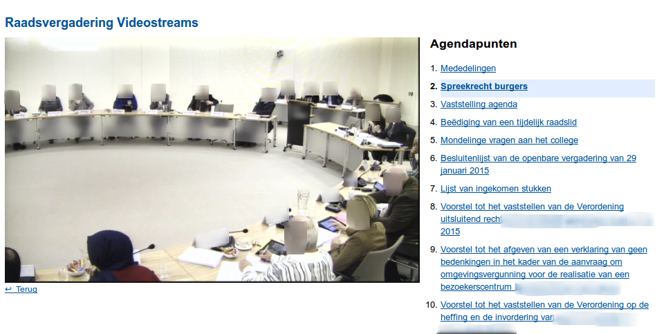

.. ==================================================
.. FOR YOUR INFORMATION
.. --------------------------------------------------
.. -*- coding: utf-8 -*- with BOM.

.. include:: ../Includes.txt

.. _introduction:

Introduction
============

.. _what-it-does:

What does it do?
----------------

Provides a REST-connector to an instance of the |videocms| to publish (lists of) videostreams. Utilizes JW Player for the viewing of said videostreams. Supports livestreaming, showing speaker metadata and (interactive) topic metadata. You will need access to a |videocms| and its REST API.

.. tip::

	To familiarize yourself with |company|'s products, you can
	consult `their website`_.

.. _screenshots:

Screenshots
-----------

   Videostream council meeting

   The frontend view when streaming a video directly available to you from your |videocms| instance.

.. _their website: http://www.streamovations.be/