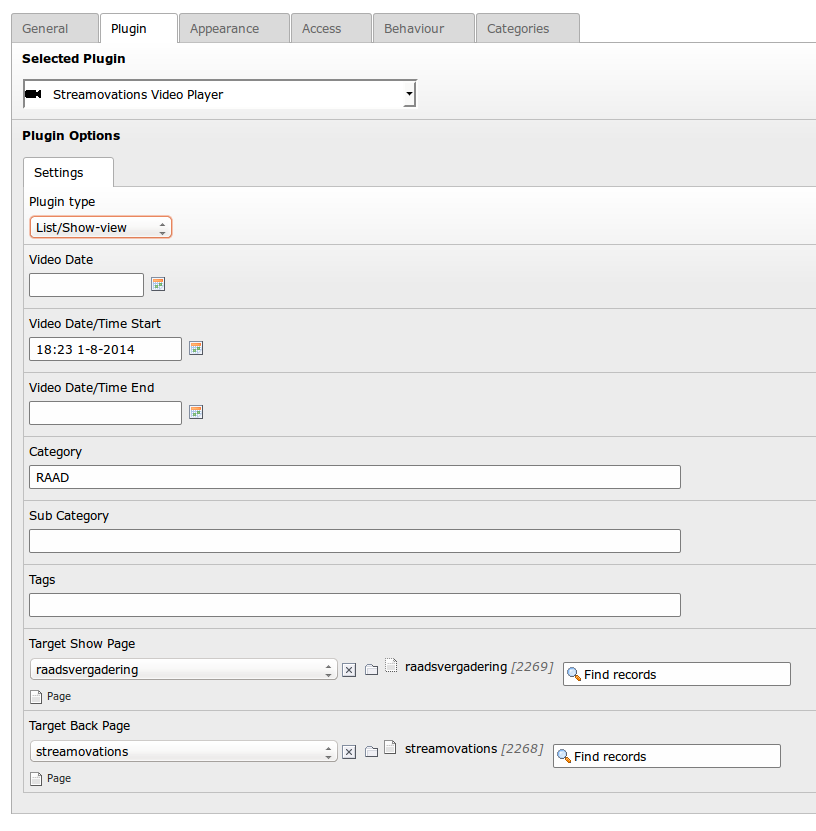

.. ==================================================
.. FOR YOUR INFORMATION
.. --------------------------------------------------
.. -*- coding: utf-8 -*- with BOM.

.. include:: ../Includes.txt

.. _user-manual:

Users Manual
============

.. _plugin-setup:

Plugin Setup
------------

   Plugin settings

   Configuration of a plugin in the TYPO3 CMS backend.

To publish videostreams on your website, insert a plugin as you would any other plugin. The plugin offers the choice of several plugin-types to choose from:

- **List/Show-view:** produce a list of events on the frontend one can click through to view individual videostreams. You need to apply a value to at least one of the date(/time) fields. All other settings are optional.
- **Preset Single Video:** produce a single video directly on the frontend, by setting the relevant session hash as taken from the |videocms|.
- **Livestream:** shows a livestream on the frontend if available. Optionally, you can set a category or tags to search in.

.. note::

   Most plugin settings are optional and are described in detail by their context-sensitive-help texts.

.. _publishing-videostreams:

Publishing Videostreams
-----------------------

The plugin allows for *automatic* publication of videostreams,
so there is little to do in the TYPO3 CMS backend once it's set up.
A videostream and its metadata are all managed/edited from within the
|videocms|. Please refer to its documentation instead.
